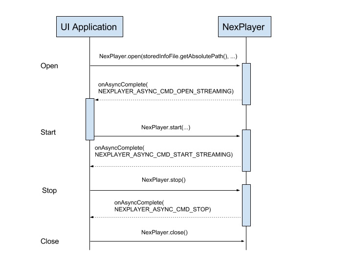

# NexPlayer™ for Android

This repository contains the sample code of NexPlayer™ Android SDK. A fully working demo can be downloaded from our [website](https://www.nexplayersdk.com/android-player-sdk).

## Getting started
For simple use cases, getting started with NexPlayer™ consists of implementing the following steps:

1. Add NexPlayer java files and native libraries to your project.
2. Create a NexPlayer instance.
3. Attach the player to a view (for video output and user input).
4. Add a listener to receive events from the player.
5. Prepare the player.
6. Release the player when done.

These steps are outlined in more detail below. For a complete example, refer to SimpleVideoPlayer in the simpleSample app.

### Adding NexPlayer
Nexplayer SDK consists of two parts(java sources and native libraries).
```
SDK
├── jni_sample
├── libs
│   ├── armeabi
│   ├── armeabi-v7a
│   └── x86
└── src
```

The first step is to create a java source directory for nexplayer java files in app's src directory. 

```shell
$ cd path/app/src/main/java
$ mkdir -p com/nexstreaming/nexplayerengine
```

Next copy java files in the src directory of NexPlayer SDK into above 'com/nexstreaming/nexplayerengine' directory.

Next copy native libraries of NexPlayer SDK into app's libs directory.
Then, app's directory structure might be as shown below.

```
simplesample
├── app
│   ├── libs
│   │   ├── armeabi
│   │   ├── armeabi-v7a
│   │   └── x86
│   └── src
│       ├── androidTest
│       ├── main
│       │   ├── java
│       │   │   └── com
│       │   │       └── nexstreaming
│       │   │           ├── nexplayerengine
│       │   │           │   └── gles
│       │   │           └── simplesample
│       │   └── res
│       └── test
└── gradle
    └── wrapper
```


### Modify build.gradle
Next modify the default source set configuration to include the directory of native libraries, as shown below:

```gradle
android {
    ...
    sourceSets {
        main {
            jniLibs.srcDirs 'libs'
        }
    }
}
```

If you want Gradle to build and package only certain ABI configurations of your native libraries, you can specify them with the ndk.abiFilters flag in your module-level build.gradle file, as shown below:
```gradle
android {
  ...
  defaultConfig {
    ...
    ndk {
      // Specifies the ABI configurations of your native
      // libraries Gradle should build and package with your APK.
      abiFilters 'x86', armeabi', 'armeabi-v7a'
    }
  }
  buildTypes {...}
  externalNativeBuild {...}
}
```

The ABIs of libs and the configuration of abiFilters must match.  
Please refer for more information [Include prebuilt native libraries](https://developer.android.com/studio/projects/gradle-external-native-builds#jniLibs) and 
[Specify ABIs](https://developer.android.com/studio/projects/gradle-external-native-builds#specify-abi) of Android Reference documentation.


### Creating the player

The code below is an example of creating a player instance and initialize the player instance.
```java
mNexPlayer = new NexPlayer();
mNexALFactory = new NexALFactory();

if( mNexALFactory.init(this, android.os.Build.MODEL, NexPlayer.NEX_DEVICE_USE_AUTO, debugLogLevel, 1 ) == NexErrorCode.NONE ) {
    Log.e(LOG_TAG, "ALFactory initialization failed");
    return -2;
}

mNexPlayer.setNexALFactory(mNexALFactory);
if( mNexPlayer.init(this) == NexErrorCode.NONE ) {
    Log.e(LOG_TAG,"NexPlayer initialization failed");
    return -3;
}
```
#####NOTE: This guide is for NexPlayerSDK version 6.64.4.754 or higher.
If you are using older version, please refer to the below
```java
mNexPlayer = new NexPlayer();
mNexALFactory = new NexALFactory();

if( mNexALFactory.init(this, android.os.Build.MODEL, NexPlayer.NEX_DEVICE_USE_AUTO, debugLogLevel, 1 ) == NexErrorCode.NONE ) {
    Log.e(LOG_TAG, "ALFactory initialization failed");
    return -2;
}

mNexPlayer.setNexALFactory(mNexALFactory);
if( mNexPlayer.init(this, 0) == false ) {
    Log.e(LOG_TAG,"NexPlayer initialization failed");
    return -3;
}
```


### Attaching the player to view

The NexPlayer library provides a NexVideoRenderer, which encapsulates a Surface onto which video is rendered. A NexVideoRenderer can be included in your application’s layout xml. 

```xml
<?xml version="1.0" encoding="utf-8"?>
<RelativeLayout
    xmlns:android="http://schemas.android.com/apk/res/android"
    xmlns:custom="http://schemas.android.com/apk/res-auto"
    android:layout_width="match_parent"
    android:layout_height="match_parent"
    android:id="@+id/parent_view" >

    <com.nexstreaming.nexplayerengine.NexVideoRenderer
        android:id="@+id/videoview"
        android:layout_width="match_parent"
        android:layout_height="match_parent"
```

Binding the player to the view is as simple as:

```java
mVideoView = (NexVideoRenderer)findViewById(R.id.videoview);
mVideoView.init(mNexPlayer);
```

### Listening to player events

Events such as changes in state and playback errors are reported to registered NexEventReceiver instances. Registering a listener to receive such events is simple:

```java
protected void addEventReceiver() {
    mNexPlayer.addEventReceiver(mEventReceiver);
    mEventReceiver = new NexEventReceiver() {
        @Override
        public void onAsyncCmdComplete(NexPlayer mp, int command, int result, int param1, int param2) {
            ...
        }

        @Override
        public void onStatusReport(NexPlayer mp, int msg, int param1) {
            ...
        }

        @Override
        public void onEndOfContent(NexPlayer mp) {
            ...
        }

        @Override
        public void onTime(NexPlayer mp, int millisec) {
            ...
        }

        @Override
        public void onError(NexPlayer mp, NexPlayer.NexErrorCode errorcode) {
            ...
        }

        @Override
        public void onVideoRenderCreate(NexPlayer mp, int width, int height, Object rgbBuffer) {
            super.onVideoRenderCreate(mp, width, height, rgbBuffer);
        }

    };
    ...
}
```

If you’re only interested in a subset of events, you can implement only the methods you’re interested in.
```java
mEventReceiver = new NexEventReceiver() {
    @Override
    public void onAsyncCmdComplete(NexPlayer mp, int command, int result, int param1, int param2) {
        ...
    }

    @Override
    public void onStatusReport(NexPlayer mp, int msg, int param1) {
        ...
    }

    @Override
    public void onEndOfContent(NexPlayer mp) {
        ...
    }

    @Override
    public void onTime(NexPlayer mp, int millisec) {
        ...
    }

    @Override
    public void onError(NexPlayer mp, NexPlayer.NexErrorCode errorcode) {
        ...
    }
};
...
```


### Preparing the player
To play the contents you want the application should call open method. The following code shows how to prepare the player.

```java
int ret = mNexPlayer.open(contentUrl, null, null,
        NexPlayer.NEXPLAYER_SOURCE_TYPE_STREAMING, 
        NexPlayer.NEXPLAYER_TRANSPORT_TYPE_TCP);
```


### Controlling the player
Playback is controlled through the NexPlayer™ class, which handles acquisition and decoding of the media data. The application issues commands to it by calling instance methods. NexPlayer™ carries out these commands asynchronously and notifies the application of changes in status.

Once the event listener and video rendering interfaces have been set up, the application may call methods on the NexPlayer™ object to control the media source. Certain calls, such as open and close must be given in matched pairs. The basic structure of calls for media playback is as follows:  

- NexPlayer.open()    
    + NexPlayer.start()
        * NexPlayer.pause() 
        * NexPlayer.seek()
        * NexPlayer.resume()   
    + NexPlayer.stop()
- NexPlayer.close()


Some commands such as open and stop take some time to execute, and follow-up commands such as start and close cannot be called immediately, but must wait until the first command has completed.

Warning:
>  However, do not call close in these event handlers as this may give rise to a deadlock. A safe way to call close is to use the Android UI main thread’s message handler.




### Rendering Captions with NexCaptionPainter
The NexCaptionPainter™ renders a variety of subtitle formats including:
* Local subtitle files (.srt/.smi/.sub)
* Timed text markup language (TTML)
* CEA 608 closed captions
* CEA 708 closed captions
* Web Video Text Tracks (WebVTT)

NexCaptionPainter should know the type of caption to be displayed. when the player open operation is completed, you can recognize the type of captions. NexPlayer invoke onStatusReport event when there is a change in the available content information. below code show how to set the type of caption.
```java
@Override
public void onStatusReport(NexPlayer mp, int msg, int param1) {
    if (msg == NexPlayer.NEXPLAYER_STATUS_REPORT_CONTENT_INFO_UPDATED) {
        mContentInfo = mNexPlayer.getContentInfo();
        int contentDuration = mContentInfo.mMediaDuration;
        mCaptionPainter.setCaptionType(mContentInfo.mCaptionType);
    }
}
```

NexCaptionPainter always needs to know the video output size in the application so that the subtitles can be correctly positioned. If a change into the video size is produced, that information should be notify to NexCaptionPainter.
```java
mCaptionPainter.setRenderingArea(new Rect(left, top, left + width, top + height), scale);
```

When a caption data is received on 'com.nexstreaming.nexplayerengine.NexPlayer.onTextRenderRender', it should be passed to NexCaptionPainter by calling the setDataSource method.
```java
@Override
public void onTextRenderRender(NexPlayer mp, int trackIndex, NexClosedCaption textInfo) {
    mCaptionPainter.setDataSource(textInfo);
}
```

### Releasing the player
After playback by NexPlayer™, NexALFactory.release should be called when instances of NexPlayer™ and NexALFactory are no longer needed.

```java
mNexPlayer.release();
mNexALFactory.release();
```

### Widevine Configuration
If you want to set Widevine DRM on NexPlayer, Here is [Widevine Integration Guide](https://github.com/NexPlayerSDK/NexPlayer_Android_Widevine) for Android with NexPlayer.
